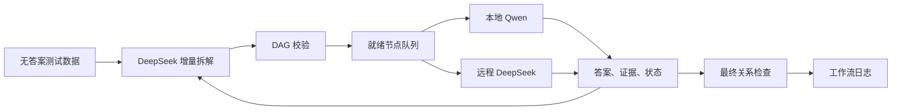

# DeRoute 项目交接

## 目标与核心思路

DeRoute 用大小模型协作完成 MuSiQue 复杂问题。大模型为 **DeepSeek-V4-Pro**（并行科技端点，见 `model.json`），负责逐步拆解、失败诊断和必要的复杂推理；小模型为 **Qwen2.5-7B-Instruct**，经本地 vLLM 以 OpenAI 兼容 API 暴露（`http://127.0.0.1:8000/v1`），优先执行简单事实查询。代码维护一个动态 DAG，把每个子任务的答案、证据和状态传给后续节点。

核心流程：



DeepSeek 每次返回 `add`、`add_batch`、`revise`、`wait`、`finish` 或 `abort` 中的一个动作。默认最多批量提出 3 个必要节点，由代码等待真实执行结果后继续规划。30 条标准拆解作为上下文示例，每次规划都会读取；这是上下文学习，不会训练或更新模型参数。

缓存命中率随并发档位与修订量在 **62%~91%** 之间波动（tw8 为 62.4%，tw4 为 75.7%~90.8%），**不是固定的 95.3%**（该数字来自 2026-09-11 前的抽样，已过时）。实测表明裁减这 30 条前缀只压缩 prefill，**几乎不影响墙钟**（见实验总结 §8.2/§8.3），故保留理由改为"省成本"而非"提速"。

## 已完成

- 数据接口只向模型提供 `id`、问题、段落编号、标题和正文，答案、标准拆解和支持标签不进入推理。
- 30-shot 示例保存在 `data_prompts/`；主提示词要求实体明确、依赖使用 `#k`、独立任务不得添加虚假依赖。
- DAG 支持分支、汇合、引用替换、环检测、时间约束和最终答案范围检查。
- 路由规则优先把简单、短上下文、少依赖的查询交给 Qwen；复杂推理、多依赖、历史时间歧义及失败恢复交给 DeepSeek。
- 执行结果记录答案、原文证据、使用的上游节点、推理类型和显式假设。错误引文和缺失依赖会被拒绝。
- 节点失败后可以修订，也可回溯修改错误祖先；下游旧答案随之失效，所有旧尝试仍保留。
- 支持调用预算、超时、原子检查点、进程锁和断点续跑。
- 独立评测只在运行结束后读取标准答案，失败计零分，同一任务取最后一次记录。

历史 7 题实测完成并答对 5 题，EM/F1 为 71.43%；初版为 3/7。这是之前版本的结果，不是调用量优化的效果。100 题正式结果见 `../DeRoute_vs_DecomP_devtest100_实验总结.md`（当前最优：tw8，480.4s / EM 59%，见该文 §8）。conda `rag310` 中 100 项离线测试全部通过。

仍失败的两题：UHF 题缺少直接的发行关系，模型拒绝把“融资支持”推成“发行”；足球题既缺少明确的 1894–95 足总杯冠军句，又需要从 Duane Courtney 的多支球队中利用后续比赛关系消歧。

另一个已知风险是语义蕴含检查仍依赖模型。代码能确认引文真实、答案词存在，却不能完全证明引文表达了目标关系。例如“位于某城市”不能自然推出“由该城市所有”。

## 本轮调用量优化（2026-09-11）

完整实现、测试、配置与新实验命令见 [CALL_REDUCTION.md](CALL_REDUCTION.md)。

- 默认事件驱动：执行完当前前沿后才调用 planner，避免 `wait` 轮询。
- `add_batch` 默认最多 3 个节点；允许独立节点和指向同批较早节点的符号依赖。整批通过图与时间校验后提交，不会留下半批节点。
- 已确定的最后一跳可随 `add`/`add_batch` 提交 `finish_after_success`。默认只在全链直接证据、未修订、未接管/额外复核时省去末尾 planner；其余情况仍继续增量规划。
- 提供合法动作、可修订目标、可结束节点、剩余预算及近期错误；明确的引用元数据由代码补齐。
- 默认 `finish.reason` 承担最后关系核验，省略理由则回退独立检查。`runtime.final_check_mode="always"` 用于保留独立核验的对照实验。
- **大模型对自身首答的 self-verify 已完全移除**（`8d6f776`）。原因：同一模型、同一上下文下复核冗余，且实测会误杀正确答案（如 "1932" 被 review 拒绝导致整题失败）。大模型的间接推断直接接受，性质仍由 `support_type="inferred"` 标注。**唯一保留的复核路径**是小模型给出 `inferred` 答案时的 fallback 复核。
- 调用和运行时间预算跨 `--resume` 累计。终止失败不重新运行；传输中断保留候选，从接管/复核阶段恢复。
- 一题累计最多修订 2 次、单节点最多 1 次（`max_revisions=1, max_total_revisions=2`）。该档是"牺牲精度换速度"曲线上的甜点：比 2/3 档快 20%、只掉 4 EM。达到总额后不再向 planner 提供 `revise`。
- **并发分两层，不要混为一谈**：任务层 `--task-workers`（默认读 `runtime.max_inflight_tasks=4`）与 API 槽位层 `large.max_concurrent=4`。把任务层提到 8、API 层保持 4，可让 planner 串行门阻塞时由其他任务顶上 API 槽位，实测墙钟 **−13.3%**（见实验总结 §8.4）。**建议把任务层默认值写进 `model.json`。**
- 默认 `small_route_mode=cost` 继续把合格 lookup 交给 Qwen 以减少大模型调用；`parallel_only` 仅用于延迟优先的对照实验，会增加大模型调用。
- API 调用保留 prompt 缓存命中和未命中 token，工作流和 `compare_runs.py` 都会汇总命中率。
- Qwen 检索在字符预算允许时从 top-3 扩展到最多 top-5，不增加小模型调用；保持 `load_in_4bit=false`，预留 RTX 5090 原精度/自动精度加载。
- DeepSeek 按 planner/answer/review/final check 设置输出上限，对 408/429/5xx/网络错误做有限退避重试。日志区分逻辑调用和实际请求，并分开记录排队、服务和退避时间。
- 协议版本为 12，需新输出目录；不要直接续跑旧实验。修改前备份路径见 `../.agents/deroute_call_reduction/progress.json`。

同一离线模拟分支任务中，调用从 11 次降至 6 次，输出一致。这只证明特定流程减少了往返，真实准确率和调用节省仍需同题、同配置口径评测。合并终检减少了一次独立语义检查，不能宣称没有准确率风险。

## 当前并行能力与后续空间

单题独立就绪节点最多并发 2 个（`runtime.max_workers`）；整批任务层默认同时推进 4 题（`max_inflight_tasks`，建议提到 8）。远程 DeepSeek 允许最多 **4** 个并发请求（`large.max_concurrent=4`），本地 vLLM Qwen 同样 4 并发。批内所有符号依赖必须等待真实上游答案。只有规划动作明确设置 `continue_planning:true` 且执行池有容量，才在执行期间提前扩展独立工作（实测触发率 0%，planner 是硬串行门）。

小模型失败后仍由原题内工作线程执行远程接管；连续批处理服务属于后续性能工作。小模型保持非量化加载，本轮只增加 GPU 锁排队时间与真实推理时间的分项统计。

并行回归使用线程事件确认本地与远程分支确实重叠；这不等于 GPU 实测提速。真实耗时应按任务墙钟时间比较，不能简单相加各模型调用耗时。

## 主要文件

| 文件 | 作用 |
| --- | --- |
| `run.py` | 命令入口、跨任务并发、逐任务检查点、输出和续跑 |
| `dataset.py` | MuSiQue 输入接口和答案字段隔离 |
| `decompose.py` | 增量规划、状态机、调度和检查点 |
| `graph.py` | DAG、依赖、修订和最终链校验 |
| `executor.py` | 检索、路由、执行、复核和证据检查 |
| `model.py` / `model.json` | DeepSeek API、本地 vLLM Qwen、缓存统计、并发和预算配置 |
| `data_prompts/` | 拆解规则和 30-shot 示例 |
| `evaluate.py` | 离线 EM/F1 评测，不调用模型 |
| `tests/test_core.py` / `tests/test_call_reduction.py` | 功能、并发与调用量回归测试 |
| `outputs/verified/` | 历史 7 题工作流、检查点和评测结果 |

## 验证命令

```bash
bash agent.sh -m unittest discover -s tests -v

bash agent.sh evaluate.py \
  --predictions outputs/verified/workflows.jsonl \
  --gold data_ori/musique_ans_v1.0_dev.jsonl \
  --output outputs/verified/evaluation.json
```

模型连接配置集中在 `model.json`。密钥只从环境变量或配置指定的 `env_file` 读取，不能写入代码、日志或交接文档。
