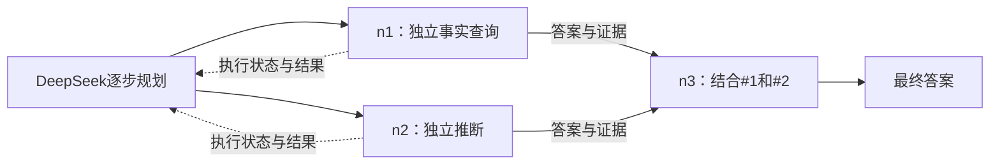

# DeRoute：逐步拆解与大小模型协作

读取 MuSiQue 问题，让 **DeepSeek Flash 增量提出必要子任务，每批最多 3 个**，由代码检查依赖、选择执行模型并调度。子任务的真实答案回传给拆解器，决定下一步，最终形成可追踪中间结果的任务流。默认执行完当前批次才继续规划，避免调用大模型等待结果；数据集运行默认并发处理 4 题，让本地 Qwen 与其他题的大模型请求重叠。

当前调用量优化、验证结果及运行方式见 [CALL_REDUCTION.md](CALL_REDUCTION.md)，项目交接见 [HANDOFF.md](HANDOFF.md)。

30 条示例来自 [musique_train_30shot_decomposition.txt](data_prompts/musique_train_30shot_decomposition.txt)。每次规划都携带这些示例，这是上下文学习，不会训练或更新模型参数。新版实验抽样测得 DeepSeek prompt 前缀缓存命中率 95.3%（该抽样基于 `deepseek-v4-pro`），因此默认保留 30-shot；可变任务状态继续放在固定前缀之后。自 2026-09-11 起远程大模型已切换为 `deepseek-flash`，其缓存命中率需重新测量。

## 运行

在 DeRoute 目录使用已有 conda `agent` 环境：

```bash
# 检查整个数据集，显示前5条；不调用模型
bash agent.sh run.py show

# 真实处理前5条：远程DeepSeek + 本地Qwen
bash agent.sh run.py run --limit 5 --live --output outputs/experiment

# 恢复暂停/中断的任务，跳过已成功或已终止的样本
bash agent.sh run.py run --limit 5 --live --output outputs/experiment --resume

# 指定样本，追加到现有记录
bash agent.sh run.py run --id 3hop2__607269_467331_162182 --live --output outputs/experiment --resume

# 处理全部数据，调用量远大于试运行
bash agent.sh run.py run --all --live --output outputs/experiment --resume

# 同批100题；默认同时处理4题，也可以显式指定
bash agent.sh run.py run --input outputs/parallel100_subset.jsonl --all --live \
  --output outputs/devtest_random100_flash_v4 --task-workers 4

# 延迟优先的路由消融：仅在同一任务存在并行前沿时使用小模型
bash agent.sh run.py run --input outputs/parallel100_subset.jsonl --all --live \
  --output outputs/devtest_random100_flash_v4_parallel_only --small-route-mode parallel_only

# 终点预声明消融：保留其他配置，关闭安全自动结束
bash agent.sh run.py run --input outputs/parallel100_subset.jsonl --all --live \
  --output outputs/devtest_random100_flash_v4_no_auto_finish --auto-finish-mode off

# 离线测试，不调用真实模型
bash agent.sh -m unittest discover -s tests -v

# 独立评测已保存的答案；标准答案不进入模型输入
bash agent.sh evaluate.py --predictions outputs/experiment/workflows.jsonl --gold data_ori/musique_ans_v1.0_dev.jsonl --output outputs/experiment/evaluation.json
```

`--input` 接受 JSONL 文件或目录，默认 `data_test/musique_ans_v1.0_dev_test.jsonl`。`data_test/` 还含有一份与主文件 ID 重叠的并行子集，因此不应把整个目录作为默认实验输入。`--id` 可重复传入，与 `--limit`、`--all` 互斥。`decompose` 是 `run` 的别名，也会执行子任务。`--task-workers` 控制跨任务并发，默认 4；`--auto-finish-mode off` 可关闭终点预声明做消融。远程 API 仍受 `large.max_concurrent=2` 限制，本地 Qwen 仍由单 GPU 锁串行执行。

已有输出时需要 `--resume`。想重新实验，用 `--output outputs/experiment2`。模型配置或提示词变化后，需要使用新输出目录，避免混用不同实验。所有输出必须位于 DeRoute 内。

## 如何拆解

拆解器每次只允许一个动作：`add` 添加节点、`add_batch` 添加有限批次、`revise` 修订节点、`wait` 等待在途结果、`finish` 核验并结束、`abort` 说明无法恢复的原因。默认由代码等待执行结果；超过批次上限的整份计划会被拒绝。批次全部通过校验才提交，错误反馈给下一次规划，连续 3 次不合法则保存原因并结束任务。已确定的符号依赖链可一批提交；必须看到上游实际实体才能消歧的步骤仍保持单步规划。

```json
{
  "action": "add",
  "node": {
    "id": "n2",
    "question": "Where was #1 born?",
    "operation": "lookup",
    "depends_on": ["n1"],
    "expected_output": "place name",
    "reason": "先前步骤查出人物，本步骤查其出生地"
  }
}
```

如果新节点已确定是原题的最后一跳，planner 可在同一个 `add` 或 `add_batch` 动作中加入：

```json
{
  "finish_after_success": {
    "final_node": "n2",
    "reason": "n2完成原题最后的出生地关系，输出是地点"
  }
}
```

`runtime.auto_finish_mode="safe"` 只在最终依赖链均为直接证据、未修订、未发生小模型接管或额外复核且图已完整时自动结束，从而省去只用于返回 `finish` 的下一次 planner 调用。任一条件不满足时，声明会被取消，planner 继续读取真实结果。设为 `off` 可做消融对照。

`#1` 指 n1 的实际答案。执行前，代码将它替换成人名，同时传入 n1 的答案、证据和解释。模型只回答当前子问题，同时接收原问题作为消歧上下文。代码从明确的 `#k` 引用生成 `depends_on`；只能指向已创建或同批较早的节点，不能猜测上游答案。添加时省略的 id 也由代码顺序填写。

节点可以在依赖仍运行时创建，等依赖成功再执行。独立节点可以形成分支，汇合节点显式引用各分支。默认要求所有正常分支成功并贡献到最终节点。恢复时，如果新链已经完整替代一个待修订的失败旁支，该旁支可保留在日志而不阻塞结束；最终链仍不能依赖它。



这是允许的工作流形状示意，实际节点取决于问题和运行结果。纯依赖链必须按顺序执行。

## 失败后如何继续

执行失败后，节点进入 `needs_revision`，候选答案和具体错误保留在 `failure_context` 中，传给下一轮规划。候选没有通过校验前不会成为上游 `output`。

模型已经声明依赖但在问题中写出明确上游答案时，代码将其规范化为 `#k`，保存原始响应和转换事件；不会猜测无法匹配的引用。

拆解器可保留原 id 修订问题或操作类型，或先添加辅助节点，再让原节点引用其结果。辅助节点的编号可以晚于被修订节点，但整个图必须无环；原问题的关系和所需答案类型不能因修订而被偷换。

若下游失败是因为上游选错实体，允许回溯修订失败链上的成功祖先。此时所有后代旧答案失效，保存历史后重新等待新输入；后代仍有运行中请求时禁止修改。可修订 id 由代码通过 `revision_targets` 提供。每个节点最多修订 2 次，一题累计最多修订 3 次；达到总上限后不再向 planner 暴露 `revise`，所有重跑仍受共享调用预算限制。总上限来自本次 100 题日志中高修订任务收益很低的观察，可通过 `runtime.max_total_revisions` 做消融。

`finish` 先检查依赖是否完整。默认由本轮规划在 `reason` 中核验原题最后一个关系与答案类型，省去单独的最终核验调用。省略理由时会回退到独立核验；设置 `runtime.final_check_mode="always"` 可始终保留独立核验。对于“所有者所在行政区”问题，代码仍会阻止仅回答所有者就结束。缺最后一跳时可以补充节点；独立核验若发现已有步骤答错或建议重复节点，会撤回旧输出并允许修订。核验仍可能出错，默认模式减少了一次独立的语义检查，准确率影响需要真实评测。

已经由大模型失败的查询，不能只改拆分理由就原样重跑；修订必须改变问题、操作、依赖、证据范围或输出要求。规划输入会提供合法动作、修订目标、可结束节点、剩余预算和近期被拒绝的动作。

规划仍优先修订原节点。如果模型已经建立完整替代链，结束时将不再使用的 `needs_revision` 旁支记入 `unused_failed_nodes`，保留失败历史；它不能是最终节点的祖先，也不能借此丢弃运行中的分支或未合并的成功分支。

子问题新增的年份限制必须来自原题或所依赖节点的实际答案，禁止为了消除歧义而任意选定年份。缩写赛季可展开为完整年份，但不能把跨年赛季当作起始年份。

## 子任务交给谁

规则在 [executor.py](executor.py)，阈值在 [model.json](model.json)，每次决定都保存理由。

| 条件 | 初始执行模型 |
| --- | --- |
| `lookup` 事实查询、至多 1 个依赖、检索命中、筛选上下文不超过 6000 字符 | 本地 Qwen |
| `compare` 比较、`reason` 推断、`summarize` 综合 | DeepSeek |
| 多个上游输入、未命中材料或超过上下文阈值 | DeepSeek |
| 跨年/赛季查询，或首选段落含至少 3 个不同历史年份而子问题没有时间限制 | DeepSeek，处理时间约束及多候选歧义 |
| 修订后的节点 | DeepSeek，结合完整上下文恢复 |
| Qwen 证据不足、输出不合法、输入超过 2400 Token 或调用失败 | DeepSeek 接管并检查保留的候选 |
| Qwen 给出间接推断 | DeepSeek 复核后才可接受 |

Qwen 首先保留词项检索排名前 3 个命中段落；在 6000 字符上下文预算内会自适应扩展到最多 5 个，不增加一次 Qwen 调用。检索对稀有词加权，优先保留完整标题实体匹配。仅在检索时折叠重音以匹配人名、地名，原始 Unicode 文本保持不变。被压平的日期比赛表在模型输入中恢复行界，引用仍对照原始段落校验。DeepSeek 执行时接收该样本的全部候选段落。检索不使用支持段落标签。

`routing.small_route_mode="cost"` 是默认值：所有符合规则的简单 lookup 仍交给 Qwen，以减少大模型 API 调用。`parallel_only` 是延迟优先的对照模式：纯串行位置直接使用 DeepSeek，只在同一任务至少有两个可并行执行节点时启用一个 Qwen 节点，并把另一个节点交给大模型形成真实重叠。后者会减少小模型调用和串行等待，但会增加大模型调用，因此没有设为当前“减少 API 调用”目标的默认值。

执行结果有七个字段：`status`、`answer`、`evidence`、`used_inputs`、`reason`、`support_type`、`assumptions`。`used_inputs` 由代码按实际传入的依赖确定并记录元数据修复，避免因漏写引用列表升级到大模型；这表示传入了哪些依赖，不证明模型的语义推理正确。证据段落必须确实提供过，摘录必须能在原文中找到。完整 JSON 外侧的 Markdown 围栏、BOM 或一层说明文本可以确定性去除，重复字段、单引号、截断和非有限数字仍被拒绝。

`support_type=direct` 表示关系由材料直接支持；直接事实提取答案还须以完整词项出现在引用中或等于上游答案；列表答案的每一项都需要对应证据。`inferred` 表示使用了间接关系、背景知识或额外假设，必须在 `assumptions` 中明确列出；不是因为答案词出现在材料中就认定关系成立。`insufficient` 可以保留未验证候选，供后续复核使用。

大模型接管时会收到小模型的候选和错误原因，可以纠正答案或补全引文。间接推断仍需要大模型复核；`reason` 的直接答案若通过与事实提取相同的引文/答案校验，可省去重复复核，其余仍复核。当前调用已在复核候选时不再重复复核。失败继续交给拆解器诊断，不能直接放行虚构引文。背景知识并未联网验证，模型复核也可能出错；工作流用 `answer_support=inferred` 标记含间接推断的答案链。

每题默认并行执行最多 2 个节点，整批默认同时运行 4 题；本地单 GPU 同时只运行 1 个 Qwen 请求，远程 DeepSeek 最多 2 个请求。这样一题等待 Qwen 时，其他题可以继续调用 planner 或执行大模型节点。规划默认等当前批次执行完成；只有动作显式声明 `continue_planning:true` 且有空闲执行槽位时，才提前扩展独立工作。`--workers` 调整题内执行线程，`--task-workers` 调整跨题并发。

这些仍是启发式规则，尚未训练难度或成本预测器。当前用离线模拟验证调用削减和恢复行为，尚未证明在真实数据集上比一次性规划或全大模型方案更便宜、更快。

## 数据与模型

[data_test/musique_ans_v1.0_dev_test.jsonl](data_test/musique_ans_v1.0_dev_test.jsonl) 有 2417 条记录、48,315 个候选段落。接口仅输出以下白名单字段：

```json
{"id":"sample-id","question":"复杂问题","paragraphs":[{"idx":0,"title":"标题","paragraph_text":"段落正文"}]}
```

接口检查字段类型、重复样本 ID、重复段落编号，错误标明文件名与行号。即使输入原始格式，答案、标准拆解和支持标签也会被投影掉。样本 ID 只用于存储，不传给模型；`data_ori/` 不参与推理，只供独立离线评测读取。本次没有修改训练示例和测试数据。

模型连接集中在 `model.json`：

- 大模型：`deepseek-flash`（2026-09-11 前为 `deepseek-v4-pro`；仓库内已有的实验结果均由 v4-pro 产出，不可混用），通过 Chat Completions API 调用；从配置指定的 `env_file`（当前 `.env`）读取地址和密钥，现有进程环境变量优先。配置和输出不保存密钥值。
- 小模型：已有的 `../models/Qwen2.5-7B-Instruct`，由 Transformers 在本机加载，保持 `load_in_4bit=false`，进程内只加载一次，可在 RTX 5090 上使用原精度/自动精度。本次没有引入量化。
- `agent.sh` 关闭在线模型下载，将运行缓存和临时文件放在 DeRoute 内。模型权重及兄弟项目只读。

API 响应中的 `prompt_cache_hit_tokens` 和 `prompt_cache_miss_tokens` 会保留在每次调用、工作流 `metrics` 及 `compare_runs.py` 汇总中。大模型默认对 408/429/5xx 和网络错误最多重试 2 次，使用带抖动的指数退避；402 不在请求层重试。`calls` 是逻辑调用，`physical_requests`/`request_attempts` 是包含重试的实际请求数。`queue_wait_seconds`、`service_seconds` 和 `retry_sleep_seconds` 分别记录限流排队、模型服务和退避等待；Qwen 也分开记录 GPU 锁等待与真实推理时间。

`large.purpose_max_tokens` 按用途限制输出：planner 384、answer/review 512、final check 384。全局 `max_tokens=1024` 是未匹配用途的后备上限。这些上限用于防止异常长输出，不会减少输入 token 或逻辑调用数。缓存数据缺失时命中率记为未知。跨任务并发后的实际整批耗时写入 `run_metrics.json`，续跑累加到 `cumulative_batch_wall_seconds`；各任务 `wall_seconds` 之和会包含并发重叠，不能当作整批墙钟。

如已有本机兼容 API 的 Qwen 服务，可将 `small` 替换为以下配置，并设置服务所需的 `QWEN_API_KEY` 环境变量；模型名应与服务一致：

```json
{"provider":"api","model":"Qwen2.5-7B-Instruct","base_url":"http://127.0.0.1:8000/v1","api_key_env":"QWEN_API_KEY","max_tokens":384,"timeout_seconds":120,"max_concurrent":1}
```

## 看执行结果与恢复

- [outputs/verified/workflows.jsonl](outputs/verified/workflows.jsonl)：本次修复验证中每个任务的运行记录，包括成功或失败的尝试。
- `outputs/<实验名>/checkpoints/*.json`：按任务独立保存的格式化快照，文件名由任务 ID 哈希生成；并发运行时互不覆盖。
- `outputs/<实验名>/run_metrics.json`：整批实际墙钟、并发数和完成/终止数量。
- [outputs/verified/evaluation.json](outputs/verified/evaluation.json)：独立评测结果，区分流程完成和答案正确。
- `nodes`：子问题、依赖、`resolved_question`（引用替换后的问题）、`input_results`（实际收到的中间结果）、路由理由、各次执行和输出证据。
- `events`：创建、开始、结束和等待的时间线；`layers` 是依赖层级，层级相同不代表实际同时执行。
- `revisions` 保存修订前的节点及尝试，`invalidations` 保存因上游改动而失效的后代记录；`stage=review` 表示候选复核，`stage=final_review` 保存最终核验拒绝的答案，`final_checked` 是原题范围核验事件。
- `unused_failed_nodes` 和 `failed_branch_replaced` 记录已被完整新链替代的失败旁支；其候选不参与最终答案及证据类型统计。
- `calls/metrics`：规划、小模型、大模型的逻辑调用、实际请求、响应、Token、排队和服务耗时。并发时分项耗时不能相加当作整体耗时；总耗时见 `wall_seconds`。

不生成 HTML 或报告脚本。首次联调的两条失败记录保留在 `outputs/initial_attempt.jsonl`，便于核对修复前后的差异。

每任务默认限 12 个节点、每节点 2 次且整题 3 次修订、24 次累计规划、48 次累计模型调用和 600 秒累计运行时间。总调用包含失败、升级、复核、最终核验及重跑。预算耗尽会终止该题，并继续处理后续样本；HTTP 402/408/429、服务端或无状态码的模型异常会保存并暂停。已发出的调用等待完成或接口超时后保存，因此实际耗时可能超过时间预算。Ctrl+C 同样保留结果。

`--resume` 跳过已成功及已终止的失败样本，仅恢复暂停/中断任务，每个任务优先使用自己的最新快照。预算不会重置；已有候选、执行阶段、错误反馈和历史调用保留，中断的大模型接管或复核不会先重跑小模型。输出目录有进程锁，快照原子写入，恢复时可修复 JSONL 最后一行写到一半的情况；最终快照尚未追加时会补记日志。当前协议版本为 12，旧版实验不能直接续跑，请使用新的输出目录。

## 调用量优化验证（2026-09-11）

conda `agent` 中 **100 项离线测试通过**，覆盖调用次数、安全自动结束、批量原子性、退避重试与物理请求统计、自适应小模型检索、跨任务并发、累计预算、缓存统计和多次中断恢复。新增的确定性两跳用例中，预声明最终节点将 planner 从 2 次降为 1 次、总调用从 4 次降为 3 次。这不是实际 MuSiQue 的准确率或速度结果。配置、对照结果和新实验命令见 [CALL_REDUCTION.md](CALL_REDUCTION.md)。

## 历史修复验证（2026-09-09，非本轮调用量优化结果）

conda `agent` 中 **50 项离线功能测试通过**，覆盖候选保留、间接推断复核、失败修订、回溯后的下游失效、最终关系与依赖链修复、替代失败旁支、并行执行、预算、断点恢复和独立评分。这些测试使用模拟模型，不是答对 50 道数据集问题。

对初版同一组 7 题真实调用 DeepSeek 和本地 Qwen，并独立匹配标准答案及别名：**完成 5 条，答对 5 条，EM/F1 均为 71.43%**；初版为 3/7（42.86%）。详情见 [独立评测](outputs/verified/evaluation.json) 和 [初版评测](outputs/baseline_evaluation.json)。未运行全部 2417 题。

| 问题 | 本轮最终结果 | 答案评测 |
| --- | --- | --- |
| Green 表演者的配偶 | Miquette Giraudy | 正确 |
| UHF 发行公司的创始人 | 发行公司确认失败，无最终答案 | 失败 |
| Ciudad Deportiva 所有者所在行政区 | Tamaulipas | 正确，原先失败 |
| Ulrich Walter 雇主总部所在城市 | Cologne | 正确，原先失败 |
| Learjet 60 制造商的所有者 | Bombardier Inc. | 正确 |
| Duane Courtney 球队最后击败指定足总杯冠军的时间 | 冠军确认失败，球队候选亦未充分消歧 | 失败 |
| Ha Hoa 所在国中，军事博物馆所在城市的地区 | South Central Coast | 正确，修复依赖链后续跑完成 |

最后一题保留了两次续跑记录；评分按每个样本最后一次记录计算，包含失败，不挑选历史最高分。最新记录合计 92 次大小模型调用，累计任务运行时间 266.836 秒，包含规划、复核、重试及续跑。本次验证不能证明降本或加速。

**仍未解决：** UHF 的发行关系和足球题的冠军/球队消歧。模型在缺少直接关系句时仍可能拒绝使用背景知识，或选到不符合后续关系的候选；重写问题和复核不能保证恢复。这两题都有标准答案，失败不代表数据不可回答。还需要可靠的外部证据补充或更有效的候选筛选；当前没有加入外部检索，也没有把标准答案写入推理提示。

测试集、原始数据和 30 条示例的 SHA256 均未变化。联调中间日志保留在其他输出子目录，当前评分统一使用 `outputs/verified/workflows.jsonl`。

## 初版验证（2026-09-09）

在 conda `agent` 中通过 25 项离线测试，包括用线程同步屏障验证独立大小模型节点确实同时运行、额度错误后的节点恢复、测试标签隔离。整个数据集通过格式检查，训练示例和测试文件的 SHA256 与修改前一致。

初版真实调用 DeepSeek 和本地 Qwen，共处理 7 条样本（前 5 条及额外 2 条分支候选），3 条完成，4 条因模型报告证据不足停止。未执行全部 2417 条；后来使用独立评测确认这 3 条答案均正确，初版 EM 为 3/7。初轮修复前的 2 条失败尝试另行保留。

| 完成样本 | 实际子任务答案 | 整体耗时 |
| --- | --- | --- |
| `2hop__460946_294723` | Steve Hillage → Miquette Giraudy | 49.084 秒 |
| `2hop__481349_302087` | Learjet → Bombardier Inc. | 18.218 秒 |
| `3hop2__607269_467331_162182` | Vietnam、Da Nang 两个分支 → South Central Coast | 42.054 秒 |

旧版 `outputs/checkpoint.json` 是最后一条成功分支案例：n1、n2 无相互依赖，n3 收到两者真实结果后交给 DeepSeek。该案例中两个初始小模型请求排队执行，Qwen 与远程规划调用存在时间重叠；独立大小模型**执行节点**同时运行的能力由离线并发测试验证，未据此宣称实测加速比例。

通过实际 `--resume` 命令复查了两条已成功样本，均直接跳过，工作流文件未变化。失败样本的原因和所有尝试均保留在日志中。

原始 2417 条问题都有标准答案，且 `answerable=true`。上面的“证据不足”是执行模型的判断，不表示题目没有答案。25 项是使用模拟模型的代码功能测试，不是答对 25 道题。

独立评测按样本 id 匹配标准答案及别名；同一 id 的重复尝试取最后一次，失败计 0 分。EM 使用英文小写、ASCII 标点删除、冠词移除及空白合并；F1 按归一化后的词项重叠计算。只统计预测日志中的样本，不把子集结果当作全测试集准确率。

## 文件阅读顺序

| 文件或目录 | 用途 |
| --- | --- |
| `run.py` | 命令入口、样本选择、输出与恢复 |
| `dataset.py` | MuSiQue 格式接口与标签隔离 |
| `decompose.py` | 单步规划、并行调度、结果反馈和检查点 |
| `graph.py` | 依赖校验、引用替换、就绪节点与层级 |
| `executor.py` | 段落检索、大小模型路由、执行及证据检查 |
| `evaluate.py` | 独立读取预测与标准答案，计算 EM/F1，不调用模型 |
| `model.py / model.json` | API、本地 Qwen、配置与共享调用预算 |
| `data_prompts/` | 单步规划指令和既有 30 条示例 |
| `data_test/ / data_ori/` | 无答案测试输入 / 原始数据备份 |
| `agent.sh / .gitignore` | conda 入口 / 缓存和产物忽略规则 |
| `tests/test_core.py` | 数据隔离、增量协议、线程并行、升级和恢复测试 |
| `outputs/` | 工作流记录与快照 |
| `references/` | 原有研究材料，不参与运行 |
| `.cache/ / .tmp/` | 自动产生的本地缓存与临时目录 |

证据检查只验证可追溯性，不能证明语义正确或拆解最优。输入已经移除标准答案，`succeeded` 表示流程及证据检查通过，不等于通过答案准确率评测。
